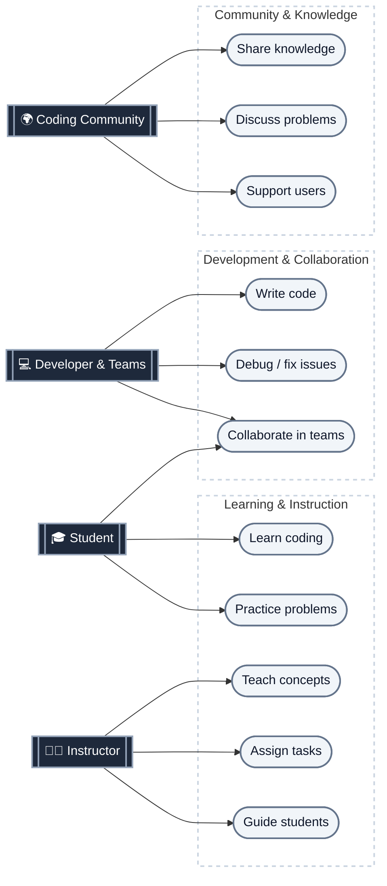

# Business & Target Audience Diagram (For Slide 1)

If you are using this diagram for your **Pitch / Problem Statement**, use this diagram! You can copy it into [Mermaid Live Editor](https://mermaid.live).

