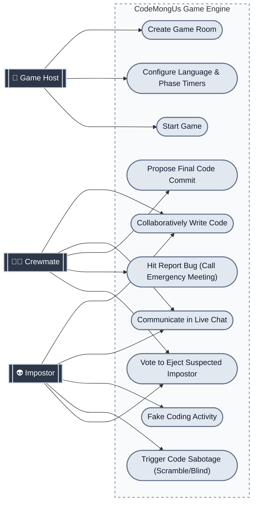

# CodeMongUs — Core Gameplay Use Case Diagram

Here is a perfectly structured UML Use Case diagram for your project. You can copy the code below into any Mermaid visualizer (like [Mermaid Live Editor](https://mermaid.live/)) to instantly generate an image for your PowerPoint, or just take a screenshot of it here if your markdown viewer supports it!

### Explaining this diagram to the Judges:
1. **The System Boundary (The dotted box):** Represents the entire CodeMongUs gameplay engine.
2. **The Actors (Dark rectangles on the left):** Shows the three distinct roles a user can hold during the game.
3. **The Use Cases (Light gray ovals):** Defines every core action available. It cleanly demonstrates that while both Crewmates and Impostors share basic features (writing code, chatting, voting), the Impostor has exclusive, dangerous permissions (Sabotage) and the Host has administrative control prior to launch.
